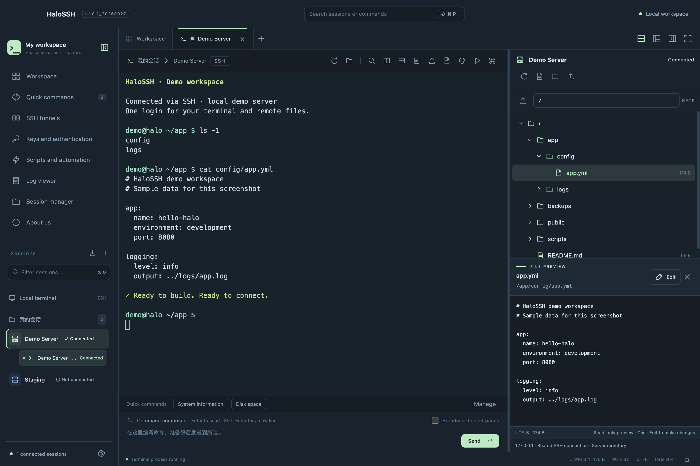
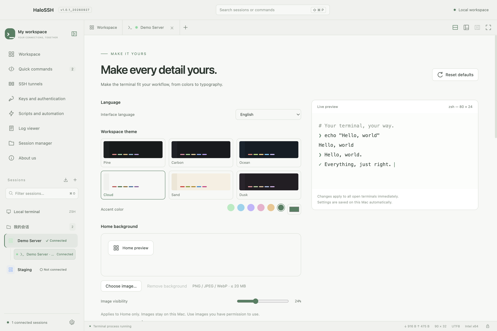

# HaloSSH

### Connect to your world. Focus on your work.

A customizable SSH terminal and remote file workspace for macOS.

**SSH · SFTP · Tabs · Split panes · Custom themes**

[Download](https://github.com/SanYeCJS/HaloSSH/releases/tag/v1.0.1_20260927) · [简体中文](README.md) · [Report an issue](https://github.com/SanYeCJS/HaloSSH/issues)

**v1.0.1_20260927 · macOS 13+ · Intel / Apple Silicon**

*An actual screenshot of this release, connected to a local demo server. All files and terminal content shown are demonstration data.*

## Why I built HaloSSH

As an iOS developer, I often connect to remote servers from my Mac to run commands, inspect logs and edit configuration files. In my own experience, I had not found a macOS SSH application that felt right for both my workflow and my visual preferences.

So I built **HaloSSH** to fill that gap in my daily work: a clear workspace that brings terminals, saved sessions and remote files together. My aim is to make connecting to servers more comfortable and straightforward, and to keep improving the app through real use.

If HaloSSH helps you, please give this repository a **Star ⭐**. Your support, suggestions and bug reports help me improve it. **Thank you to everyone who uses and supports HaloSSH!**

## What’s new in v1.0.1

SSH handshake timing now follows your system settings; recent sessions use current saved profiles. This release also improves log scrolling, copy/paste and reconnect, with persistent session labels and one notice per outage.

[Release notes](docs/RELEASE-v1.0.1_20260927.md) · [Versioning](docs/VERSIONING.md)

## Download and install

| Your Mac | Installer |
|---|---|
| Apple Silicon / M-series | [Download arm64 DMG](https://github.com/SanYeCJS/HaloSSH/releases/download/v1.0.1_20260927/HaloSSH-1.0.1_20260927-arm64.dmg) |
| Intel | [Download x64 DMG](https://github.com/SanYeCJS/HaloSSH/releases/download/v1.0.1_20260927/HaloSSH-1.0.1_20260927-x64.dmg) |

1. Check your chip type in Apple menu → About This Mac and download the matching installer.
2. Open the DMG and drag **HaloSSH** into **Applications**.
3. Choose a language and theme, and optionally import sessions. The first-run setup can be skipped.
4. Enter `user@host:port` to start an SSH login. Once authenticated, servers with SFTP support automatically appear in the right-hand file tree.

Requires **macOS 13 or later**. Users do not need Xcode, Node.js or a separate Python installation. This release is for macOS; a Windows installer is not available.

**Release status:** the app is currently ad-hoc signed and has **not been signed with an Apple Developer ID or notarized by Apple**. See the [installation notes](docs/INSTALL.md) if macOS blocks the first launch. The Intel build has been run and tested locally. The arm64 build has passed architecture, dependency, signature and disk-image checks, but **has not yet been run on M-series hardware**.

Both installers and SHA-256 checksums are available under [Release assets](https://github.com/SanYeCJS/HaloSSH/releases/tag/v1.0.1_20260927).

## Features

### A workspace for your servers

- Organize sessions into folders and favorites; search them or return through recent history with connection start times.
- See live connection entries in the sidebar, with connection status indicators in tabs.
- Terminal and file channels to the same server count as one connected server.
- Confirm deletions before they happen, including remote files and history entries; clear recent history or favorite shortcuts in one action.

### One SSH login, terminals and files together

- SSH2 through macOS OpenSSH, with password, private-key and interactive authentication, SSH Agent, jump hosts, keepalive and port forwarding.
- The right-hand SFTP tree reuses the active SSH login, avoiding a second file-manager password prompt.
- Browse directories on demand, upload and download, create files and folders, rename and delete. Results are refreshed after the server responds.
- Preview text as read-only, select **Edit** to make changes, then save to the server. Saving checks whether the remote file has changed.
- Open file or folder properties from the context menu and close them to give the tree more room.

The automatic file tree requires a working SFTP subsystem on the server. Text preview and editing support **UTF-8 files up to 2 MiB**; other files can be downloaded for editing.

### Tabs, split panes and flexible layouts

- Switch between tabs and close tabs to the left, right or all other tabs.
- Reorder multiple connection tabs, detach them into another window and drag them back. A single connection tab cannot be dragged.
- Use up to four terminal panes per tab, with adjustable direction and proportions.
- Resize the sidebars, bottom command area and split panes; collapse panels and retain layout settings.
- Use quick commands, multiline composition, pane broadcasting, search and customizable key mappings.

### Make it yours

- Six light and dark themes, with customizable accent, terminal text, background and cursor colors.
- Adjustable fonts, sizes and line spacing. Bundled **JetBrains Mono** and **Source Code Pro**, system font choices and local font import.
- macOS acrylic backgrounds, adjustable transparency and a custom workbench background image.
- Instant switching between Simplified Chinese and English; a short, optional first-run setup.
- Terminal contrast enhancements for improved readability with light backgrounds and colored output.

### Additional tools

| Area | Available capabilities |
|---|---|
| Connections | Local shell, SSH2, SFTP, FTP / FTPS, Telnet, SSH1, Rlogin and serial |
| Networking | Local, remote and dynamic SOCKS forwarding; jump hosts; HTTP CONNECT / SOCKS proxy settings |
| Remote desktop | Embedded RDP with keyboard and mouse input, resolution settings, text clipboard and optional audio |
| Automation | JavaScript / Python scripts, terminal input recording, highlight rules, notifications and automatic replies |
| Transfers | Graphical file management and XMODEM / YMODEM / ZMODEM |
| Logs | Raw or plain-text logging, timestamps and rotation, search, terminal export and PDF |
| Configuration | Workspace and theme import/export; basic OpenSSH Config import |
| Workspace protection | Optional master-password encryption, workspace locking, host fingerprint confirmation and OS-encrypted file credentials |

Advanced protocols and hardware-dependent features need more real-world validation. Compatibility with every server or enterprise authentication setup is not guaranteed. RDP currently excludes RemoteApp, drive/printer/smart-card redirection, gateways and Azure AD sign-in. Review scripts before running them. A forgotten master password cannot be recovered.

## Feedback and contact

- [Report a bug or suggest a feature](https://github.com/SanYeCJS/HaloSSH/issues). Include the app version, macOS version, chip type and steps to reproduce. Please omit passwords, private keys and sensitive server details.
- Author: [SanYeCJS](https://github.com/SanYeCJS)
- Email: [742377690@qq.com](mailto:742377690@qq.com)

If you enjoy HaloSSH, share it with a friend and leave a **Star ⭐**. Thank you!

## Copyright and licenses

Copyright © 2026 HaloSSH contributors. HaloSSH's own code and documentation use the [MIT License](LICENSE). Third-party components retain their respective licenses; see the [third-party notices](docs/THIRD_PARTY_NOTICES.txt) and **About** in the app. Required corresponding source and notices accompany the installers.

This repository currently hosts the product documentation, screenshots and releases. Use the software only for lawful purposes and on systems you are authorized to access, in accordance with applicable laws and service terms. The software is provided as-is under its license.
