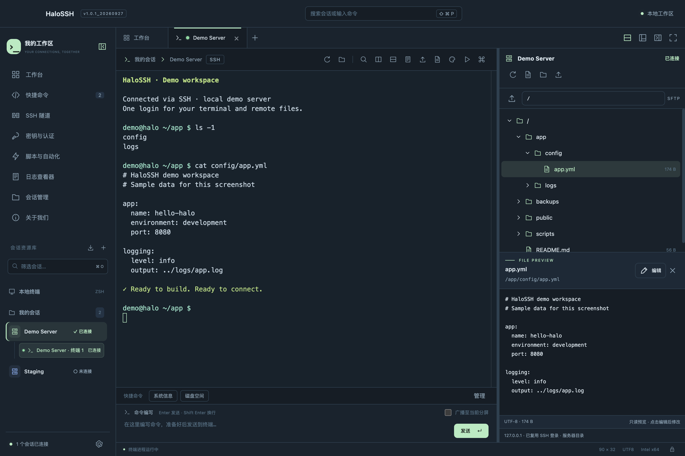
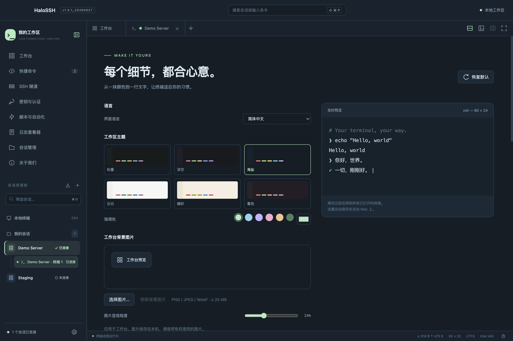

# HaloSSH — Mac SSH 客户端与 SFTP 文件管理

### 连接世界，专注此刻。

HaloSSH 是一款面向 macOS 的 SSH 客户端，集成 SSH 终端、SFTP 文件管理与文本编辑，支持 Intel 和 Apple Silicon Mac。

**SSH · SFTP · 多标签 · 分屏 · 自定义主题**

[下载安装](https://github.com/SanYeCJS/HaloSSH/releases/tag/v1.0.2_20260928) · [English](README.en.md) · [功能介绍](#功能介绍) · [问题反馈](https://github.com/SanYeCJS/HaloSSH/issues)

**v1.0.2_20260928 · macOS 13+ · Intel / Apple Silicon**

*当前版本的真实运行截图。连接与文件内容来自本地演示服务器，不包含真实业务服务器信息。*

## 为什么开发 HaloSSH

作为一名 iOS 开发者，我经常需要在 Mac 上连接远程服务器、执行命令、查看日志和修改配置。但在自己的使用过程中，我一直没有找到一款足够顺手、同时符合自己审美和工作习惯的 macOS 远程 SSH 软件。

于是，我开发了 **HaloSSH**，希望补上自己日常工作流里的这块空白：把终端、会话管理和远程文件放在同一个清晰的工作区，让连接服务器这件事更直观、更舒服。这是基于我的个人使用体验，也是我想持续完善这款软件的初衷。

如果 HaloSSH 对你有帮助，欢迎点击仓库右上角的 **Star ⭐**。你的支持、建议与问题反馈，都是我继续改进它的动力。**感谢每一位使用和支持 HaloSSH 的朋友！**

## v1.0.2 更新

修复运行 Codex CLI 时标签移出窗口后滚轮失效和持续输出闪烁的问题。跨窗口保留鼠标协议、光标、滚动区域与历史阅读位置；普通终端新增 Shift+↑/↓ 和 Shift+PageUp/PageDown 浏览历史。

[完整更新说明](docs/RELEASE-v1.0.2_20260928.md) · [版本管理规则](docs/VERSIONING.md)

## 下载与安装

| 你的 Mac | 安装包 |
|---|---|
| Apple Silicon，M 系列芯片 | [下载 arm64 DMG](https://github.com/SanYeCJS/HaloSSH/releases/download/v1.0.2_20260928/HaloSSH-1.0.2_20260928-arm64.dmg) |
| Intel 处理器 | [下载 x64 DMG](https://github.com/SanYeCJS/HaloSSH/releases/download/v1.0.2_20260928/HaloSSH-1.0.2_20260928-x64.dmg) |

1. 在 Apple 菜单的“关于本机”中确认芯片类型，下载对应安装包。
2. 打开 DMG，将 **HaloSSH** 拖入 **Applications（应用程序）**。
3. 启动应用，按需选择语言、主题和导入会话；首次引导可以跳过。
4. 输入 `用户名@主机:端口` 开始 SSH 登录。认证成功后，支持 SFTP 的服务器会自动显示右侧文件树。

需要 **macOS 13 或更新版本**。安装使用不需要 Xcode、Node.js 或额外安装 Python。当前仅提供 macOS 版本，尚无 Windows 安装包。

**本次发布状态：**应用目前使用 ad-hoc 本地签名，尚未完成 Apple Developer ID 签名及公证。下载后可能遇到 macOS 安全提示，请查看[安装说明](docs/INSTALL.md)。Intel 安装包已在本机运行验证；arm64 安装包完成架构、依赖、签名及磁盘映像检查，**尚未在 M 系列真机运行验证**。

安装包与 SHA-256 校验文件均位于 [Release 附件](https://github.com/SanYeCJS/HaloSSH/releases/tag/v1.0.2_20260928)。

## 功能介绍

### 一个工作区，管理多台服务器

- 会话文件夹、收藏、搜索和最近使用记录，显示最近一次连接的开始时间。
- 左侧树形会话列表显示正在使用的连接子项；标签以绿点和红点表示连接状态。
- 同一服务器的终端和文件连接合并计数，方便了解当前连接了几台服务器。
- 最近记录、收藏入口和远程文件的删除均有确认窗口；支持一键清除历史与常用入口。

### SSH 登录一次，终端与文件一起使用

- SSH2 使用 macOS OpenSSH，支持密码、私钥和终端交互认证，以及 SSH Agent、跳板机、保活和端口转发。
- SSH 登录成功后，右侧文件树复用当前连接的认证，无需再次输入文件管理密码。
- 支持按需展开目录、上传、下载、新建文件或文件夹、重命名及删除；操作结果以服务器响应为准。
- 文本文件默认只读预览，点击“编辑”后修改并保存到服务器；保存前检查远程文件是否被改动。
- 文件或文件夹的“属性”通过右键打开，可手动关闭，让文件树获得更多空间。

自动文件树需要服务器提供 SFTP 子系统。内置文本编辑支持不超过 **2 MiB 的 UTF-8 文本**，其他文件可下载后处理。

### 标签、分屏与可调布局

- 多标签切换，右键关闭左侧、右侧或其他会话。
- 多个连接标签可拖动排序、移入新窗口，再拖回标签栏插入；只有一个连接标签时禁用拖动。
- 每个标签最多四个终端分屏，可调整方向与比例。
- 左右侧栏、底部命令区域和终端分屏支持拖动调整；面板可折叠，并保存布局设置。
- 快捷命令、多行命令编写、分屏广播、搜索和按键映射，减少重复操作。

### 让终端适应你的习惯

- 六套深浅主题，可调整强调色、终端文字、背景与光标颜色。
- 字体、字号、行距可调；内置 **JetBrains Mono** 和 **Source Code Pro**，也可选用系统字体或导入本地字体。
- macOS 亚克力背景、通透强度与工作台自定义背景图片。
- 简体中文和 English 即时切换；首次启动可选择语言、主题并导入已有会话。
- 终端文字对比度增强，改善浅色背景和彩色输出的可读性。

### 更多工具

| 分类 | 已提供的能力 |
|---|---|
| 连接方式 | 本地 Shell、SSH2、SFTP、FTP / FTPS、Telnet、SSH1、Rlogin、串口 |
| 隧道与网络 | 本地、远程及动态 SOCKS 转发；跳板机；HTTP CONNECT / SOCKS 代理配置 |
| 远程桌面 | 应用内 RDP，键鼠输入、分辨率设置、文本剪贴板及可选音频 |
| 自动化 | JavaScript / Python 脚本、终端输入录制、规则高亮、通知与自动响应 |
| 文件传输 | 图形文件管理，以及 XMODEM / YMODEM / ZMODEM |
| 日志 | 原始或纯文本日志、时间戳与轮转、搜索、终端内容导出和 PDF |
| 配置 | 工作区及主题导入导出、OpenSSH Config 基础字段导入 |
| 工作区保护 | 可选主密码加密、工作区锁定、主机指纹确认、系统加密保存文件凭据 |

高级协议及硬件相关功能仍需要更多真实环境反馈，当前不承诺覆盖全部服务器和企业认证组合。RDP 尚不包含 RemoteApp、磁盘/打印机/智能卡重定向、网关及 Azure AD 登录。使用脚本前请先检查内容；主密码无法找回。

## 反馈与联系

- [提交问题或建议](https://github.com/SanYeCJS/HaloSSH/issues)：请附版本、macOS 版本、芯片类型和复现步骤；不要附密码、私钥或敏感服务器信息。
- 作者 GitHub：[SanYeCJS](https://github.com/SanYeCJS)
- 联系邮箱：[742377690@qq.com](mailto:742377690@qq.com)

欢迎将 HaloSSH 分享给有需要的朋友。喜欢的话，给项目一个 **Star ⭐**，谢谢！

## 版权与许可

Copyright © 2026 HaloSSH contributors。HaloSSH 自有代码及文档采用 [MIT License](LICENSE)；第三方组件遵循各自许可，详见[第三方声明](docs/THIRD_PARTY_NOTICES.txt)及应用“关于我们”。许可要求的对应源码与说明随安装包提供。

本仓库当前用于发布软件介绍、截图和安装包。软件应仅用于你拥有权限的服务器与合法用途；使用者应遵守适用法律及服务协议。软件按许可证约定以现状提供。
